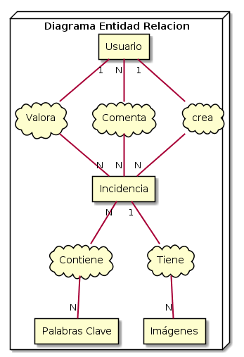

# Pokejas! Atrápalas todas

Memoria del proyecto de la asignatura de Tecnologías Web del curso 2018/2019.

El objetivo es crear una página web para anotar las quejas de un vecindario. En nuestro caso, hemos decidido un toque más y ambientarlo en el mundo pokemon de forma que nuestros vecinos sean estos adorables seres.

##### Autores:

Laura Gómez Garrido

Paula Ruiz García
## Requisitos Funcionales

Comenzaremos listando los requisitos  funcionales de nuestro sistema que hemos ido deduciendo que teníamos que conseguir a partir de nuestro guión del proyecto.

### Comunes a todos los usuarios

+ Ver incidencia
* Visualizar incidencias
* Visualizar comentarios y valoraciones de cada incidencia
+ Realizar nuevos comentarios
+ Realizar valoraciones

### Visitantes
+ Registrarse y darse de alta **(OPCIONAL)** - Pag 6 guión.
+ Iniciar sesión

### Colaboradores y Administradores
+ Crear nuevas incidencias
  - Aquí no es necesario poner la opción de añadir fotografías.
+ Cerrar sesión
+ Modificar datos personales, todo salvo Rango (y Estado, opcional)
+ Ver sus propias incidencias
+ Modificar sus propias incidencias
    - Aquí se podrán añadir tantas fotografías como el usuario desee. (Recomendado uso de AJAX y JavaScript)
+ Borrar sus propias incidencias

### Administradores
+ Visualizar usuarios registrados
+ Crear nuevo usuario
+ Eliminar usuario
+ Gestión de perfiles de usuarios.
+ Modificar estado de una incidencia
+ Consultar eventos del sistema (log)
+ Modificar y borrar incidencias de cualquier usuario.
+ Crear copia de seguridad de la BBDD.
+ Subir copia de seguridad de la BBDD. **(OPCIONAL)**
+ Borrar BBDD. **(OPCIONAL)**
+ Otras tareas, como administrar BBDD. **¿Especificar cuáles implementamos?**

### Log de la Aplicación
+ Registro de los eventos principales del sistema, entre ellos:
+ Identificación de un usuario.
+ Registro de un usuario.
+ Cada vez que un usuario modifique la BBDD.
+ Cierres de sesión.
+ Intentos de identificación erróneos.

### Listado de incidencias
Se puede ordenar según los siguientes criterios:
+ Antigüedad
+ Valoraciones positivas
+ Valoraciones positivas netas

Además, se puede filtrar según los siguientes criterios:
+ Coincidencia de texto en título, descripción o palabras clave.**(Texto contenido, una única caja de texto)**
+ Lugar de la incidencia **(Desplegable)**
+ Estado del mensaje **(Múltiple checkbox)**
+ Seleccionar palabra clave **(Desplegable, OPCIONAL)**

### Barra Lateral:
+ Ranking N usuarios que más incidencias añaden.
+ Ranking N usuarios que más opinan
+ Número de inciencias resueltas, pendientes, etc...

## Datos a almacenar
A partir de los anteriores requisitos, esta claro que vamos a tener que almacenar información dentro de una base de datos. Por ello, primeros mostraremos el modelo entidad relación básico que habrá dentro de nuestra base de datos, seguido tendremos el diseño lógico de esta y, finalmente, mostraremos cómo son las tablas que hemos creado para esto junto con una breve descripción de la utilidad de cada una.

### Modelo Entidad-Relación

### Diseo Lógico

### Tablas
Cada una de las categorías se refiere a una tabla en sql por lo que también indicaremos los tipos de cada dato.

#### Incidencia
Cuando un vecino del municipio detecta el mal funcionamiento de algún servicio, puede proceder a poner una incidencia en el sitio web para que esta sea conocida por otros vecinos y por las autoridades con competencia para su resolución. Dicha incidencia debe contener los siguientes datos:
- Identificador (int) - Primary Key, Autoincrement
- Titulo (varchar(50))
- Positivas (int) default 0
- Negativas (int) default 0
- Palaras clave (Tabla)
- Fecha (smalldatetime)
- Usuario (int) - Foreign Key
- Estado (Enum - Pendiente, Comprobada, Tramitada, Irresoluble, Resuelta)

Tanto las fotografias, como las palabras clave, las valoracones no anónimas y los comentarios serán almacenados en unas tablas independientesy se conseguirá la información a través de operaciones de tablas.

#### Colaboradores
Estos usuarios son los que van a nutrir de contenido al sitio web. Serán usuarios registrados en el sistema y tienen la posibilidad de añadir nuevas incidencias. La información que se almacena de ellos es la siguiente:
  - Identificador (int) - Primary Key, Autoincrement
  - Nombre (varchar (50))
  - Apellidos, o en nuestro caso Familia (varchar(20))
  - Email (varchar(50))
  - Dirección (varchar(100))
  - Teléfono (varchar(15))
  - Password (varchar(15))
  - Rango (Enum - Administrador, Colaborador)
  - Estado (Enum - Inactivo, Activo) - **(OPCIONAL)**

El identificador será también el nombre de las imágenes a la hora de almacenarlo. Funcionamiento similar al de la tabla imágenes.

#### Log de la aplicación
Registro de los eventos principales del sistema, contendrá:
+ Hora y fecha del evento
+ Breve Descripción
+ Identificador (int) - Primary Key, Autoincrement

#### Palabras clave
Necesario para facilitar la búsqueda de incidencias dependiendo de las palabras clave que esta contenga. Tendrá una relación con incidencias de muchos a muchos.
- Clave (varchar(30)) - Primary Key

#### Relación de palabras clave e incidencias
Necesaria para establecer la relación de muchos a muchos entre incidencias y palabras claves.
- Clave (varchar(30)) - Foreing Key
- Identificador de la incidencia (int) - Foreign Key
Juntos, forman la Primary Key.

#### Imágenes
Una incidencia puede contener muchas imágenes asociadas.
- Identificador (int) - Primary Key, Autoincrement
- Identificador de incidencia (int) - Foreign Key

La idea es almacenar las imágenes en una carpeta dentro de nuestra web para que así sea más rápida la carga y además así la velocidad de acceso será mayor y el almacenamiento en la base de datos será menor. El identificador de cada imagen en la base de datos será el nombre que tendrá la imagen en la carpeta. No se especifica el nombre de la carpeta donde se almacenará para que así sea el propio progamador web quien pueda decidir donde almacenarlo.

#### Valoración
Relación de una valoración realizada por un usuario respecto a una incidencia concreta. La clave primaria será un identificador porque también puede ser realizada por un usuario anónimo. Como restricción, sólo se puede repetir una vez el par (usuario,incidencia).
+ Identificador (int) - Primary Key, Autoincrement
+ Identificador de Usuario (int) - Foreign Key
+ Identificador de incidencia (int) - Foreign Key
+ Valoración positiva (bit)
+ Valoración negativa (bit)

#### Comentarios
Relación entre los comentarios realizados por los usuarios y las incidencias en las que sucede. La clave primaria será un identificador porque también pueden realizar comentarios un usuario anónimo y, además, no hay límite de comentarios por usuario en cada incidencia.
+ Identificador (int) - Primary Key, Autoincrement
+ Identificador de Usuario (int) - Foreign Key
+ Identificador de incidencia (int) - Foreign Key
+ Comentario (varchar(300))

## Restricciones y anotaciones
+ Tanto los usuarios registrados como los visitantes podrán hacer una única valoración de cada incidencia. **(Uso de cookies en caso de los invitados, tablas en caso de usuarios registrados.)**
+ Se deberá mostrar un mensaje informando sobre el éxito o fracaso de cualquier modificación en la BBDD.
+ Los administradores no pueden registrarse de forma autónoma. Será otro administrador quien le aporte dicho rango.
+ Siempre debe de haber al menos un administrador.
+ Implementar avatar por defecto.
+ Implementar administrador por defecto en caso de que no haya ninguno. (Usuario: admin Contraseña: admin). **Cuidado, esto debe de funcionar tanto al inicio del sistema como si al restaurar la BBDD no se pone ningún administrador.**
+ Mostrar incidencias por lotes **(OPCIONAL)**

## Usuarios nuevos
+ email: pikapi@gmail.com contraseña: ashesmiamo
+ email: eeveelucion@correo.com contraseña:flareonpresident
+ email: growlithe@admin.com contraseña:admin
+ email: lindoskitty@gmail.com contraseña:delgatoalhecho
