# Pokejas! Atrapalas todas

Memoria del proyecto de la asignatura de Tecnologías Web del curso 2018/2019.

El objetivo es crear una página web para anotar las quejas de un vecindario. En nuestro caso, hemos decidido un toque más y ambientarlo en el mundo pokemon de forma que nuestros vecinos sean estos adorables seres.

##### Autores
  Laura Gómez Garrido
  Paula Ruiz García

##### Fichero de Restauracion de la BD.
database.sql

## Diseño de la aplicacion.
#### Busqueda
A continuación vemos un ejemplo de como funciona nuestra busqueda, y es que tenemos una serie de filtros para mostrar las incidencias que nos van a ir saliendo, las podemos filtrar segun un orden, palabras que buscamos que contengan, el lugar donde ha ocurrido y el estado en el que estan.

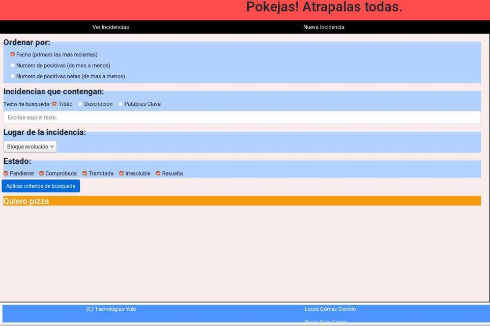

Ademas, en este apartado hemos implementado JavaScript para que en principio solo nos muestre el nombre de las incidencias y a continuación, si pinchamos en el titulo, se nos mostrara la incidencia completa, con toda su información, junto con sus comentarios y las opciones a las que podemos optar si somos usuarios colaboradores o invitados(personas que no estan registradas en nuestra página).

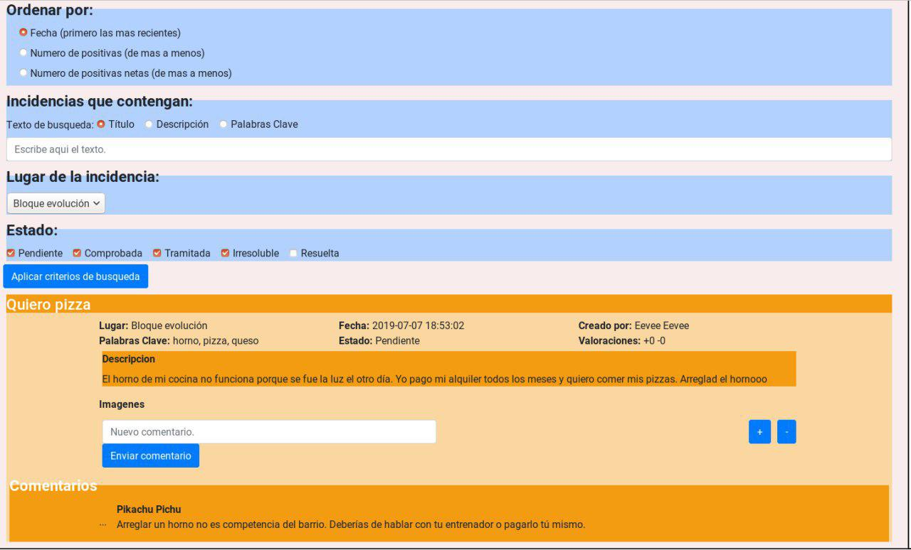

Si por casualidad somos Administradores de la pagina, ademas nos saldran las opciones de borrar y editar las incidencias de otros usuarios.

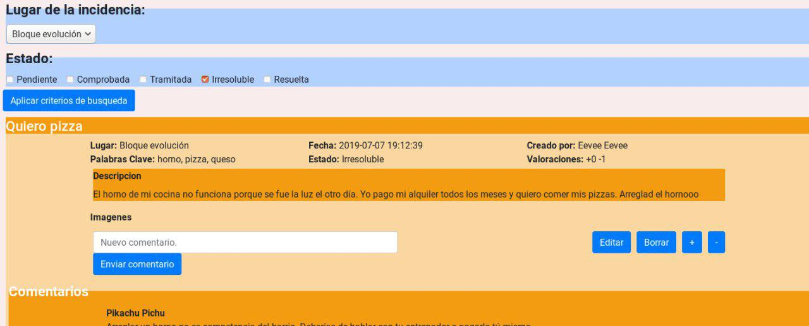

#### Incidencias
Para la organización de las incidencias contamos con diferentes tipos de paginas a los que podemos acceder tanto siendo Colaboradores como Administradores, pero los segundos con más beneficios que los primeros.

###### Nueva Incidencia
Todos los usuarios registrados tienen la opcion de añadir incidencias a nuestra pagina web, y todas empiezan con el mismo estado Pendiente, y son los Administradores los encargados de ir registrando las distintas etapas en las que se encuentra una incidencia.

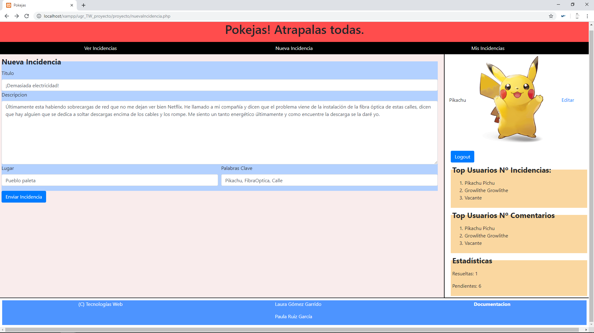

###### Mis Incidencias y Editar Incidencia
Ademas, todos los usuarios registrados tienen acceso a ver las incidencias que ellos mismos han publicado y editar sus datos. Aqui tenemos la misma opción que en busqueda de pulsar el titulo de la incidencia para verla entera, asi los usuarios que tenga muchas quejas pueden tener una mejor organización.

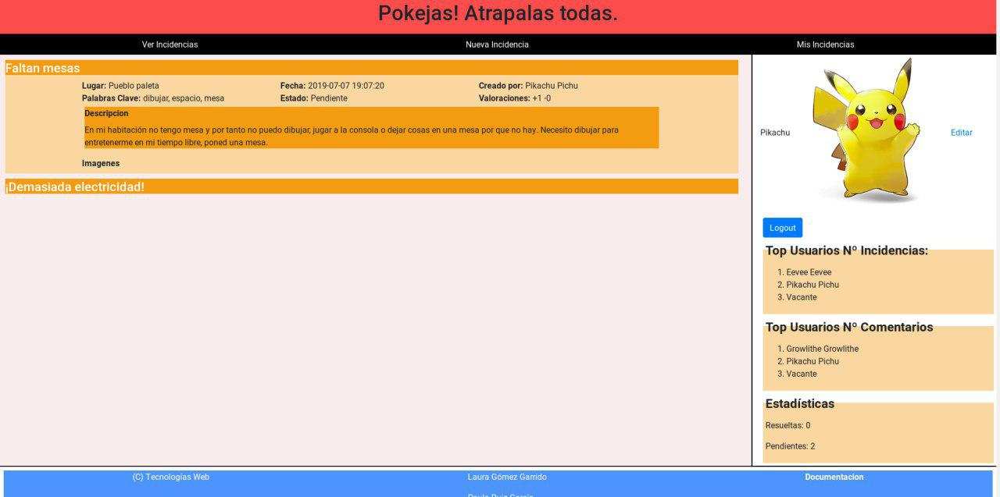

Además los Administradores tienen la opción de editar cualquier incidencia de nuestra página.

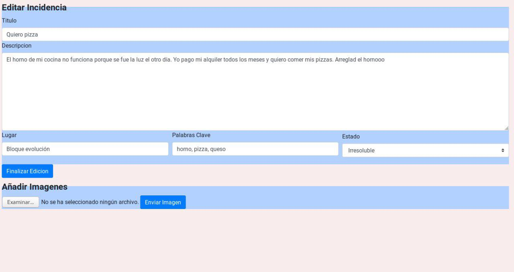

#### Usuario

###### Nuevo Usuario
Si no estas registrado en la nuestra pagina y buscas entrar en nuestra bonita comunidad, la opcion de `Registrarse` en el apartado del logearse en nuestra mejor solución ya que gracias a esta pagina cualquiera puede registrarse, pero siempre tienes que esperar a que nuestros administradores te den de alta en la pagina, ya que una siempre que se crea un nuevo usuario se añade como inactivo hasta que nuestro administrador de el visto bueno.

Ademas, el administrador tambien tiene la opcion de añadir nuevos usuarios a nuestra web.

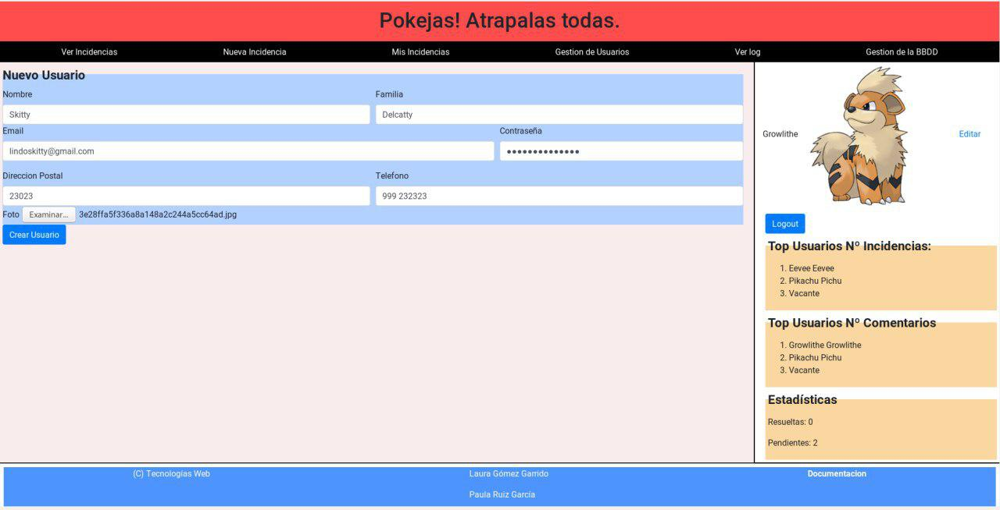

###### Editar Usuario
Cualquier usuario registrado tiene la opción de editar sus propiedades, además si eres administrador tienes las opciones de activar o desactivar un usuario, mediante el desplegable de estado, o de editar el rango de un usuario cualquiera (excepto si eres Growlithe, a quien nadie puede quitarle el poder o borrarlo).

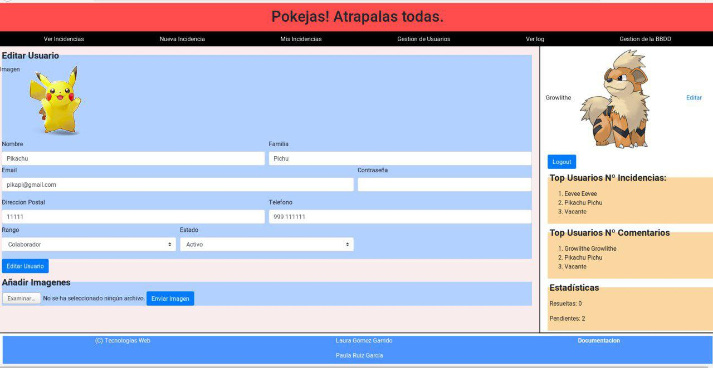

#### Opciones del Administrador unicamente
El administrador es el principal encargado de asegurar el buen funcionamiento de nuestra web, y, además, de mantener el orden entre los usuarios. Por ello tiene una serie de nuevas opciones en su barra de navegacion.

###### Gestión de usuarios
En ella podemos ver todos los usuarios registrados en nuestra pagina y tenemos las opciones de borrar o editar un usuario, y dentro hacerlo pasar de inactivo a activo y viceversa. Ademas podra añadir todos los usuarios que vea necesarios.

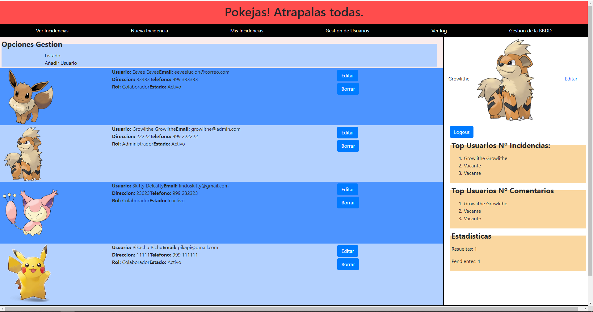

###### Gestion de Base de Datos
En esta pagina tenemos la opcion de hacer una copia de nuestra base de datos y guardarla como un fichero `.sql` para poder cargarla en otro momento.

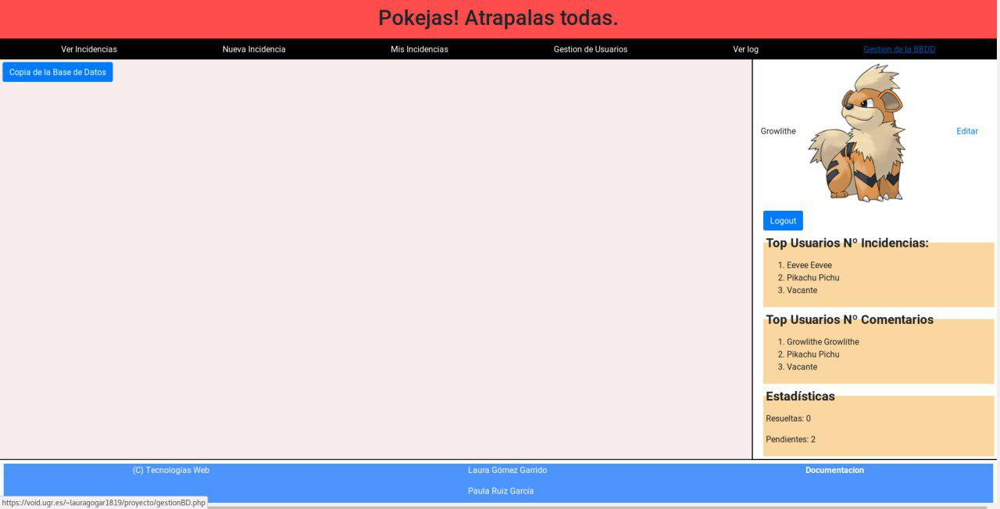

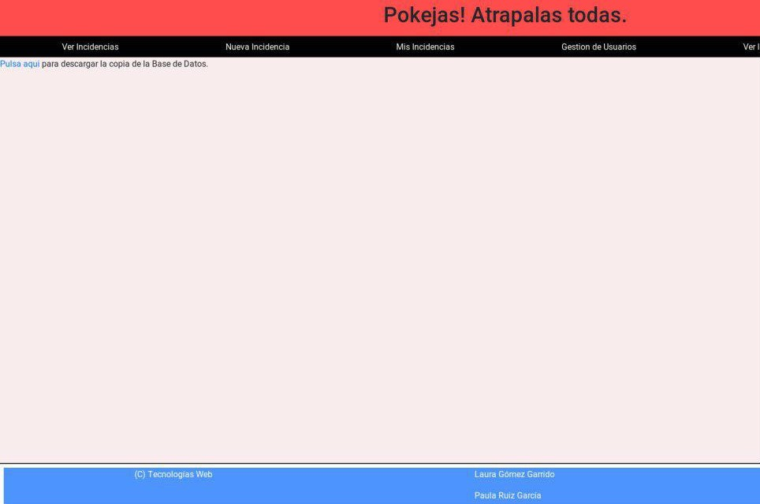

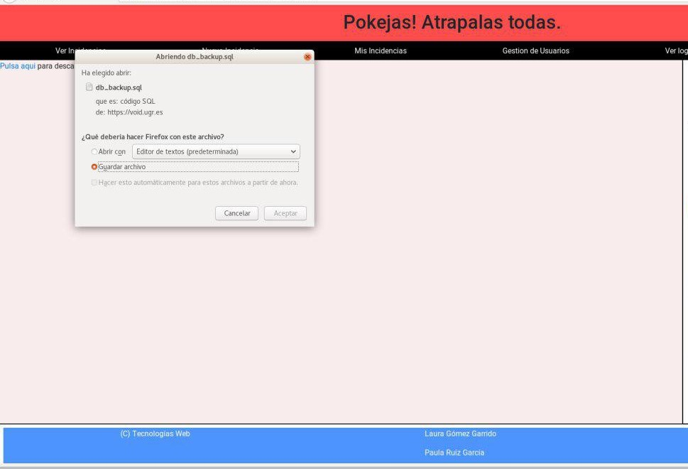

###### Ver log
Por ultimo, una de las cosas más importantes de ser administrador, es que tienes acceso para ver lo que va ocurriendo en la pagina web mediante una tabla que proporciona todas las acciones que se realizan en la pagina con respecto al uso de la base de datos.

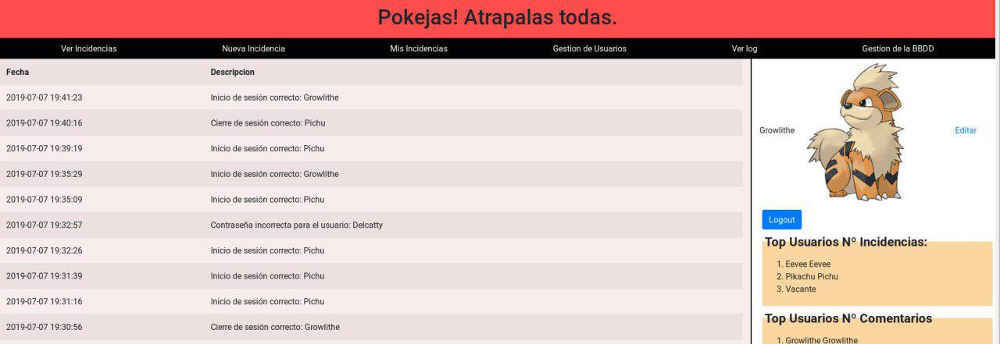

## Requisitos Funcionales

### Comunes a todos los usuarios

+ Ver incidencia
* Visualizar incidencias
* Visualizar comentarios y valoraciones de cada incidencia
+ Realizar nuevos comentarios
+ Realizar valoraciones

### Visitantes
+ Registrarse y darse de alta **(OPCIONAL)** - Pag 6 guión.
+ Iniciar sesión

### Colaboradores y Administradores
+ Crear nuevas incidencias
  - Aquí no es necesario poner la opción de añadir fotografías.
+ Cerrar sesión
+ Modificar datos personales, todo salvo Rango (y Estado, opcional)
+ Ver sus propias incidencias
+ Modificar sus propias incidencias
    - Aquí se podrán añadir tantas fotografías como el usuario desee. (Recomendado uso de AJAX y JavaScript)
+ Borrar sus propias incidencias

### Administradores
+ Visualizar usuarios registrados
+ Crear nuevo usuario
+ Eliminar usuario
+ Gestión de perfiles de usuarios.
+ Modificar estado de una incidencia
+ Consultar eventos del sistema (log)
+ Modificar y borrar incidencias de cualquier usuario.
+ Crear copia de seguridad de la BBDD.
+ Subir copia de seguridad de la BBDD. **(OPCIONAL)**
+ Borrar BBDD. **(OPCIONAL)**
+ Otras tareas, como administrar BBDD. **¿Especificar cuáles implementamos?**

### Log de la Aplicación
+ Registro de los eventos principales del sistema, entre ellos:
+ Identificación de un usuario.
+ Registro de un usuario.
+ Cada vez que un usuario modifique la BBDD.
+ Cierres de sesión.
+ Intentos de identificación erróneos.

### Listado de incidencias
Se puede ordenar según los siguientes criterios:
+ Antigüedad
+ Valoraciones positivas
+ Valoraciones positivas netas

Además, se puede filtrar según los siguientes criterios:
+ Coincidencia de texto en título, descripción o palabras clave.**(Texto contenido, una única caja de texto)**
+ Lugar de la incidencia **(Desplegable)**
+ Estado del mensaje **(Múltiple checkbox)**
+ Seleccionar palabra clave **(Desplegable, OPCIONAL)**

### Barra Lateral:
+ Ranking N usuarios que más incidencias añaden.
+ Ranking N usuarios que más opinan
+ Número de inciencias resueltas, pendientes, etc...

## Datos a almacenar
A partir de los anteriores requisitos, esta claro que vamos a tener que almacenar información dentro de una base de datos. Por ello, primeros mostraremos el modelo entidad relación básico que habrá dentro de nuestra base de datos, seguido tendremos el diseño lógico de esta y, finalmente, mostraremos cómo son las tablas que hemos creado para esto junto con una breve descripción de la utilidad de cada una.

### Modelo Entidad-Relación

### Diseo Lógico

### Tablas
Cada una de las categorías se refiere a una tabla en sql por lo que también indicaremos los tipos de cada dato.

#### Incidencias
Cuando un vecino del municipio detecta el mal funcionamiento de algún servicio, puede proceder a poner una incidencia en el sitio web para que esta sea conocida por otros vecinos y por las autoridades con competencia para su resolución. Dicha incidencia debe contener los siguientes datos:
- Identificador (int) - Primary Key, Autoincrement
- Titulo (varchar(50)) NOT NUll
- Lugar (varchar(50)) NOT NULL
- Descripcion (varchar(500))
- Positivas (int) default 0
- Negativas (int) default 0
- Fecha (timestamp) default CURRENT_TIMESTAMP on update CURRENT_TIMESTAMP
- Usuario (int) - Foreign Key
- Estado (Enum - Pendiente, Comprobada, Tramitada, Irresoluble, Resuelta)

Tanto las fotografias, como las palabras clave, las valoracones no anónimas y los comentarios serán almacenados en unas tablas independientesy se conseguirá la información a través de operaciones de tablas.

#### Usuarios
Estos usuarios son los que van a nutrir de contenido al sitio web. Serán usuarios registrados en el sistema y tienen la posibilidad de añadir nuevas incidencias y de valorar o comentar las ya existentes. La información que se almacena de ellos es la siguiente:
  - Identificador (int) - Primary Key, Autoincrement
  - Nombre (varchar (50))
  - Apellidos, o en nuestro caso Familia (varchar(20))
  - Email (varchar(50))
  - Dirección (varchar(100))
  - Teléfono (varchar(15))
  - Password (varchar(15))
  - Rango (Enum - Administrador, Colaborador)
  - Estado (Enum - Inactivo, Activo)
  - extImagen (VARCHAR(10))

El identificador será también el nombre de las imágenes a la hora de almacenarlo. Funcionamiento similar al de la tabla imágenes. Por eso, almacenamos también la extensión que tiene nuestra imagen a la hora de guardarla, para no tener problemas con el formato de la imagen a la hora de abrirla.

En nuestro caso particular, los nombres de las imágenes serán de la forma `Usuario-{identificador usuario}.{extension}`

##### Usuarios ya registrados
+ email: pikapi@gmail.com contraseña: ashesmiamo
+ email: eeveelucion@correo.com contraseña:flareonpresident
+ email: growlithe@admin.com contraseña:admin
+ email: lindoskitty@gmail.com contraseña:delgatoalhecho

#### Log
Registro de los eventos principales del sistema, contendrá:
+ Identificador (int) - Primary Key, Autoincrement
- Fecha (timestamp) default CURRENT_TIMESTAMP on update CURRENT_TIMESTAMP
- descripcion VARCHAR(300)

#### Palabras clave
Necesario para facilitar la búsqueda de incidencias dependiendo de las palabras clave que esta contenga. Tendrá una relación con incidencias de muchos a muchos. Esta tabla, es básicamente, para asegurarnos de que las palabras clave que escribimos son únicas.
- Clave (varchar(30)) - Primary Key

#### RelClaveIncidencia
Necesaria para establecer la relación de muchos a muchos entre incidencias y palabras claves.
- Clave (varchar(30)) - Foreing Key
- Incidencia (int) - Foreign Key
Juntos, forman la Primary Key.

#### Imágenes
Una incidencia puede contener muchas imágenes asociadas.
- Identificador (int) - Primary Key, Autoincrement
- Incidencia (int) - Foreign Key
- Extension (VARCHAR(10)) - FOREIGN KEY

La idea es almacenar las imágenes en una carpeta dentro de nuestra web para que así sea más rápida la carga y además así la velocidad de acceso será mayor y el almacenamiento en la base de datos será menor. El identificador de cada imagen en la base de datos servirá para controlar el nombre que tendrá la imagen en la carpeta. No se especifica el nombre de la carpeta donde se almacenará para que así sea el propio progamador web quien pueda decidir donde almacenarlo.

En nuestro caso particular, los nombres de las imágenes serán de la forma `Incidencia-{identificador incidencia}-{identificador imagen}.{extension}` y estarán almacenadas en la carpeta imágenes.

#### Valoración
Relación de una valoración realizada por un usuario respecto a una incidencia concreta.
+ Identificador de Usuario (int) - Foreign Key
+ Identificador de incidencia (int) - Foreign Key
+ Valoración (ENUM - Positiva, Negativa)
Usuario e incidencias forman, juntos, la clave primaria. En este caso, sólo controlamos que los usuarios registrados no hagan más de una valoración para cada incidencia. Nótese que cada vez que hacemos una nueva valoración para una determinada incidencia el contador correspondiente que posee la incidencia crece. De esta forma, esta tabla servirá para controlar que las valoraciones de nuestros usuarios sean únicas para cada incidencia y no para utilizarla como contador.

#### Comentarios
Relación entre los comentarios realizados por los usuarios y las incidencias en las que sucede. La clave primaria será un identificador porque también pueden realizar comentarios un usuario anónimo y, además, no hay límite de comentarios por usuario en cada incidencia.
+ Identificador (int) - Primary Key, Autoincrement
+ Identificador de Usuario (int) - Foreign Key
+ Identificador de incidencia (int) - Foreign Key
+ Comentario (varchar(300))

## Restricciones y anotaciones
+ Tanto los usuarios registrados como los visitantes podrán hacer una única valoración de cada incidencia. **(Uso de cookies en caso de los invitados, tablas en caso de usuarios registrados.)**
+ Se deberá mostrar un mensaje informando sobre el éxito o fracaso de cualquier modificación en la BBDD.
+ Los administradores no pueden registrarse de forma autónoma. Será otro administrador quien le aporte dicho rango.
+ Siempre debe de haber al menos un administrador.
+ Implementar avatar por defecto.
+ Implementar administrador por defecto en caso de que no haya ninguno. (Usuario: admin Contraseña: admin). **Cuidado, esto debe de funcionar tanto al inicio del sistema como si al restaurar la BBDD no se pone ningún administrador.**
+ Mostrar incidencias por lotes **(OPCIONAL)**

## Desarrollo de la práctica

#### Consultas a la Base de Datos
Para este apartado hemos desarrollado una clase llamada BaseDeDatos que se encuentra guardada en la ruta `proyecto/core`. En esta clase no sólo nos encargamos de realizar la conexión a la base de datos de nuestra página sino que también es la encargada de realizar todas las consultas. Es decir, cuando vayamos a realizar una consulta no nos tendremos que preocupar de ver cómo hacemos la consulta ni tampoco de cómo evitar algunos problemas como pueden ser la inyección sql, porque ya lo hace esta clase.

Todas y cada una de las consultas que vayamos a utilizar están implementadas aquí de forma segura y nos ahorramos el tener que ir pensando cómo debemos de redactar una consulta cada vez que sea necesario en nuestro código php. Es decir, estamos añadiendo una pequeña capa de abstracción.

#### Modelos de datos
Sin embargo, no siempre es del todo útil trabajar sólo con los resultados de la base de datos y por ello hemos implementado algunas clases que nos ayudan a almacenar los datos y agruparlos de forma útil dentro de nuestro código. Estas clases también no serán de utilidad a la hora de utilizar Twig para nuestro código html. Estas, se encuentran en la ruta `proyecto/core/modelo` y son las siguientes:
+ Aside: tiene como constructor el recibir un número, este número será el que utilizará para delimitar el tamaño de los rankings que esta clase almacena. Después de todo, en definitiva se encarga de consultar la base de datos para obtener la información interesante que hemos utilizado para crear el aside de nuestra página como puede ser el ranking de usarios con más incidencias, el ranking de usuarios con más comentarios, el número de incidencias pendientes, entre otros.
+ Comentario: clase con un constructor que se encarga de asignar los valores de las variables que almacena. Sirve como representación de un comentario con toda su información asociada.
+ Usuario: clase con un constructor que se encarga de asignar los valores de las varibles que almacena. Sirve como representación de usuario con toda su información asociada.
+ Log: clase con un constructor que se encarga de asignar los valroes de las variables que almacena. Sirve como representación de un elemento de nuestro log de la aplicación con toda su información asociada.
+ Incidencia: clase con un constructor con el id de la incidencia que representa. Esta clase se encarga de realizar la búsqueda por sí misma a base de datos para obtener todos los datos que la representan. No sólo eso, sino que también realiza la consultas necesarias para crear el usuario asociado a la insidencia y los comentarios asociados junto con sus usuarios utilizando los constructores de asignación de las otras clases.

Nótese, que a veces será la propia base quien nos dará estas clases ya creadas y otras seremos nosotros quienes los creemos a partir de determinados parámaetros.

#### Vista
A la hora de realizar la estructura visual de nuestro proyecto hemos utilizado principalmente HTML5, o explicado en partes, hemos usado HTML, CSS y JavaScript.
Para la estructura basica en HTML hemos usado un fichero para cada una de las paginas, ya que esto nos proporciona una mayor organización de ficheros. Lo primero que implementamos fue un fichero `base.html` en el cual añadimos todas las partes principales de una pagina web, como son la cabecera, la barra de navegacion, la barra lateral y el pie de pagina. A partir de esta base, mediante la herencia de ficheros, vamos creando el resto de paginas (con lo que evitamos el copia y pega de codigo que tan poco nos gusta). Todas estan plantillas estan creadas dentro de la clase `vista`, ya que asi tenemos todo codigo mejor organizado.

Los siguientes dos tipos de lenguajes que hemos usado estan almacenados dentro de la carpeta de `assets`, y estos son los mecanismos con los cuales hemos adaptado la interfaz para que le sea mas fácil al usuario utilizarla.
Continuamos añadiendole el CSS propio a cada una de nuestras paginas, para ello hemos usado dos herramientas, CSS3 implementado por nosotras, para añadir los colores que mas nos gustaban y organizar nuestras vistas para el usuario, y Bootstrap, para que la pagina se adapte mejor a cualquier tipo de pantalla. Además nos ayuda a la hora de adecuar los formularios para una mejor interfaz entre el cliente y el servidor.
Y por ultimo usamos JavaScript para un par de cosas basicas, que son el validar los datos a la hora de insertar datos dentro de nuestra BD (datos basicos como correo, direccion postal, telefono...etc), y para las paginas donde se muestran las incidencias, ya que gracias a JavaScript solo mostramos el contenido de aquella en la que pinchamos, aunque nos muestre el titulo de todas, nosotros buscamos la que mas nos guste.

Con todo esto resumimos la parte de la vista del usuario, ademas para enlazar esta parte con en el controlador y hacerlo todo más fácil, hemos implementado un motor de plantillas denominado Twig, el cual nos proporciona un trabajo más fácil a la hora de organizar el html y conseguir los valores que el controlador nos proporciona, para poder mostrarlos de manera más sencilla que utilizando solo PHP. Twig nos organiza el html de manera que todo es html, y asi el evitar la mezcla de lenguajes ayuda tambien a conseguir una mejor interpretación y entendimiento del código.

#### Controlador
El controlador son los ficheros `.php` implementados dentro de la carpeta general proyecto, además de los ficheros de carga de Twig.
Estos ficheros `.php` son una de las cosas primordiales dentro de nuestro proyecto ya que sin ellos no nos funcionaria ninguna de las implementaciones y las opciones de busqueda de nuestros ficheros.
Nosotras hemos implementado el controlador de tal manera que cada una de las paginas tiene su fichero `.php` asociado, para que no haya errores en la carga y en la gestion de los mismos, y las variables no se pierdan de su camino a solucionar nuestras consultas.
Los formularios los hemos implementado todos con `post` ya que es la manera más sencilla de que mediante la url no se pueda acceder a nuestra Base de Datos, de esta forma tendremos una medida de seguridad extra para impedir que metan datos que puedan estropear nuestra pagina web.
